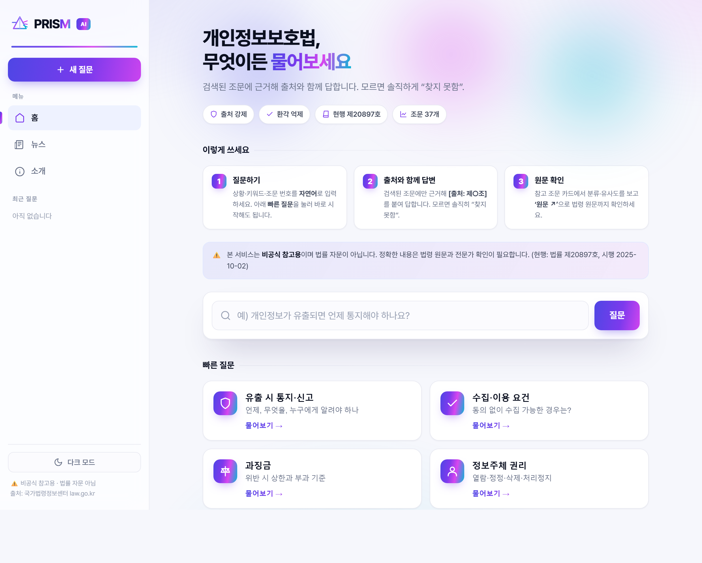
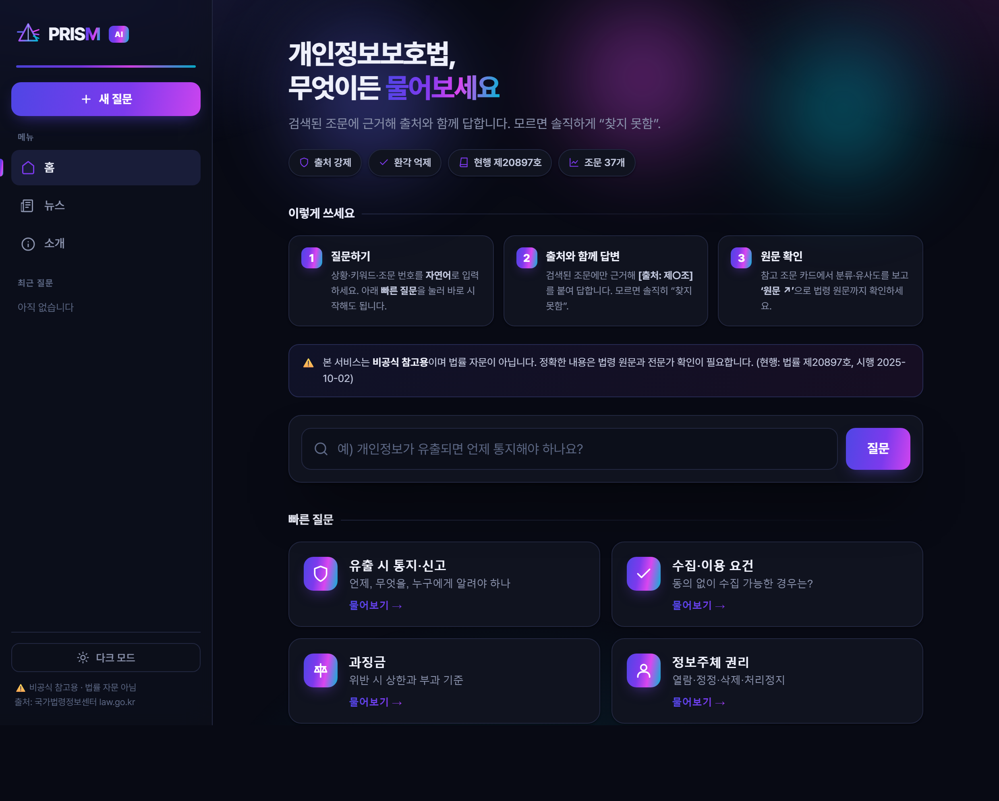
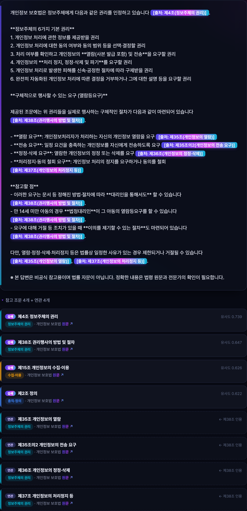
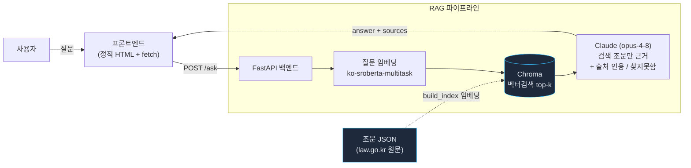

# PRISM — 개인정보보호법 RAG 챗봇

> **P**rivacy **R**egulation **I**ntelligent **S**earch **M**odel
> 개인정보·데이터 규제 법령(개인정보보호법·정보통신망법·신용정보법·AI기본법)을 자연어로 질문하면, 관련 조문을 **검색**해 쉬운 말로 답하고 **출처(법령·조/항/호)를 인용**하는 RAG 챗봇.

[](https://pmo88-prism.hf.space)


**▶ 라이브 데모: [pmo88-prism.hf.space](https://pmo88-prism.hf.space)** · 무료 호스팅이라 첫 응답은 콜드스타트로 ~1분 걸릴 수 있습니다.

> ⚠️ **비공식 참고용입니다. 법률 자문이 아니며, 정확한 내용은 법령 원문과 전문가 확인이 필요합니다.**
> 현행 기준: **개인정보 보호법(법률 제20897호, 시행 2025-10-02)**.

---

## 미리보기

| 홈 — 라이트 | 홈 — 다크 |
|:---:|:---:|
|  |  |

**출처와 함께 답하는 답변 화면** — 글래스 답변 카드 · 조문 카테고리별 컬러 소스 · 인용 칩



---

## 한눈에 보기

자연어 질문 → 한국어 임베딩으로 관련 조문 검색 → Claude가 **검색된 조문에만 근거**해 출처를 인용하며 답변. 모르면 지어내지 않고 "찾지 못함"이라고 답합니다.

| 질문 | 동작 |
|---|---|
| "개인정보가 유출되면 언제 통지해야 하나?" | 제34조 근거로 "알게 된 때 지체 없이" + 통지 항목, **시행령 소관인 구체 기한은 "확인할 수 없다"고 명시(날조 안 함)** `[출처: 제34조(...)]` |
| "동의 없이 수집 가능한 경우는?" | 제15조·제16조·제28조의2 근거 답변 |
| "과징금은 얼마까지?" | 제64조의2 — **전체 매출액의 100분의 3** (현행) |
| "드론 촬영 규제 알려줘" (없는 주제) | "제공된 조문에서는 찾지 못했습니다" + 제25조는 고정형이라 드론과 다름을 구분 |

**왜 이 주제인가** — 2026 개정 논의(과징금 상향·CPO 책임 등)와 "AI 융합사회" 규제로 개인정보×AI는 가장 시의성 높은 영역. 보안·법규 도메인 이해와 RAG/FastAPI 엔지니어링을 동시에 증명.

---

## 아키텍처



데이터(조문 JSON) → 임베딩 → 벡터스토어에 1회 적재. 런타임에는 질문만 임베딩해 top-k 조문을 가져와 LLM 컨텍스트로 주입.

**Hybrid 검색 (Vector + 구조화)**: 벡터 top-k에 더해, 검색된 조문이 본문에서 인용하는 **연관 조문**을 상호참조 그래프로 함께 묶어 제공한다. 예) "목적 외 이용"으로 제18조가 잡히면 제18조가 인용하는 제15·17조도 연관으로 동봉. (외부 법령 인용 「…법」 제N조는 제외)

---

## 기술 스택 & 선택 이유

| 영역 | 선택 | 이유 |
|---|---|---|
| 백엔드 | **FastAPI** + uvicorn | 타입 검증(pydantic)·자동 Swagger·async. RAG API 서버에 적합 |
| LLM | **Anthropic Claude** (opus-4-8) | 한국어 품질·instruction following. adaptive thinking으로 근거 추론 |
| 임베딩 | **sentence-transformers** `jhgan/ko-sroberta-multitask` | 한국어 SBERT, **로컬·무료**(API 비용 0), 768차원 |
| 벡터검색 | **Chroma** (코사인) | 영구 저장·간단한 API, 메타데이터 필터 |
| 프론트 | **정적 HTML + fetch** | 의존성 0, FastAPI가 직접 서빙 → 단일 서비스로 배포 단순 |

---

## 핵심 설계 원칙 (환각 억제)

법률 도메인이라 **정확성·근거**가 생명. 시스템 프롬프트 + **코드 후처리**(`generator._finalize`)로 다음을 강제:

1. **검색된 조문에만 근거** — 제공되지 않은 내용은 추측·생성 금지
2. **출처 인용 강제 + 코드 검증** — `[출처: 제29조(안전조치의무)]` 형식. 인용한 조문이 실제 검색 결과에 없으면(날조 의심) 코드가 경고 배너 부착
3. **모르면 "찾지 못함"** — 다른 지식으로 메우지 않음
4. **고지문 코드 강제** — LLM이 누락해도 코드가 면책 고지를 항상 부착
5. **현행 기준 명시** — 미시행 개정분은 단정하지 않음

---

## 빠른 시작

```powershell
# 1) 가상환경 + 의존성
python -m venv venv
.\venv\Scripts\Activate.ps1
pip install -r requirements.txt

# 2) 환경변수 — .env 에 ANTHROPIC_API_KEY 입력
Copy-Item .env.example .env

# 3) 데이터 검증 + 인덱스 빌드
python -m scripts.validate_data
python -m scripts.build_index      # "유출 통지 → 제34조" 스모크 테스트 포함

# 4) 테스트 (LLM 비호출 — 안전 불변식·API 검증 회귀 방지)
pytest

# 5) 서버 실행
uvicorn app.main:app --reload
#   → http://127.0.0.1:8000  (UI)
#   → http://127.0.0.1:8000/docs  (Swagger)
```

> Windows 콘솔이 cp949면 한글 출력이 깨질 수 있어 스크립트는 UTF-8로 강제(`sys.stdout.reconfigure`). 일회성 실행 시 `$env:PYTHONUTF8=1`.

---

## 검색 정확도 (평가)

LLM을 빼고 **검색 단계만** 측정한다(질문 임베딩 → 벡터 top-k). 정답은 "가장 관련 깊은 단일 조문"으로 큐레이션한 26개 질의 기준:

| 지표 | 값 |
|---|---|
| recall@1 | **0.885** (23/26) |
| recall@4 | **0.923** (24/26) |
| MRR | **0.904** |

```bash
python -m scripts.eval_retrieval   # eval/eval_set.json 기준
```

> 점수를 100%로 맞추지 않았다 — 미스 2건은 실제 한계다. "동의 없이 수집"은 제15조 대신 인접 조문을, "불법 유출 벌칙"은 제71조(벌칙) 대신 제59조(금지행위·유출 금지)를 상위로 반환. **정직한 측정**이 목적.

> 📐 설계 선택의 근거·트레이드오프(ADR): **[DESIGN.md](DESIGN.md)**

---

## 기술적 난제와 해결

### 1. 환각 억제 = 출처 강제
LLM이 그럴듯한 법조문을 지어내는 것이 가장 큰 위험. **검색된 조문만 컨텍스트로 주입 + 출처 인용·찾지못함을 시스템 프롬프트로 강제**해 해결. 실증: "유출 통지 기한"을 물으면 제34조에 없는 구체 일수(시행령 소관)를 지어내지 않고 "확인할 수 없다"고 답하고, 색인에 없는 "드론 규제"는 "찾지 못함"으로 답함.

### 2. 한국어 임베딩 선택
영어 모델은 한국어 법률 용어 검색 품질이 낮음. `ko-sroberta-multitask`(한국어 SBERT)를 **로컬 추론**으로 채택 → API 비용 0, 데이터 외부 미전송. L2 정규화 후 코사인 유사도로 검색. ("유출 통지" 질의에서 제34조가 거리 0.41로 1위)

### 3. 법령 데이터 정확성 (날조 0)
법조문은 한 글자도 틀리면 안 됨. 내 기억이 아니라 **국가법령정보센터(law.go.kr) 원문**을 수집. 병렬 에이전트로 **4개 법령(개인정보보호법·정보통신망법·신용정보법·AI기본법) 54개 핵심 조문**을 모으고, **독립 재페치로 교차검증**(서로 다른 출처가 호 개수·중간점까지 일치하는지). 현행 버전 명시(개인정보 보호법 법률 제20897호 등). 과징금은 추측성 "10%"가 아닌 **현행 3%**를 정확히 반영. 검증 불가한 조문은 데이터셋에서 제외(예: 위치정보법은 law.go.kr 접근 오류로 미수록).

### 4. Windows Smart App Control × scipy DLL 차단
이 PC는 Smart App Control(Enforce)이 켜져 있어 pip로 받은 **scipy 1.15+의 `_cyutility` 컴파일 DLL을 차단** → sklearn→sentence-transformers 연쇄 import 실패. 영향 범위를 모듈별로 진단(torch·chromadb는 통과)하고, `_cyutility`가 없는 **scipy<1.15(1.14.x)로 고정**해 numpy 2.x 호환을 유지하며 해결.

### 5. 적대적 전수조사 → 코드 강제 안전망 + 테스트
멀티에이전트 적대적 감사로 "출처 강제가 프롬프트 지시일 뿐 코드 보장이 없다"는 갭을 스스로 발견 → 면책 고지·출처 인용을 **결정론적 후처리(`_finalize`)로 코드 강제**(LLM이 누락·날조해도 경고 배너 부착)하고, 순수 함수로 분리해 **pytest 단위 테스트**로 회귀 방지. 외부 뉴스 fetch의 SSRF(사설·메타데이터 IP 차단)·응답 크기 상한·캐시 스탬피드(단일비행 락)도 함께 하드닝.

---

## 본인 기여

데이터 파이프라인(law.go.kr 원문 수집·구조화·검증) → 임베딩/벡터검색 → RAG 백엔드(FastAPI, 출처 강제 프롬프트, 예외처리) → 프론트엔드까지 **전 구간 직접 설계·구현**. 각 기술 선택의 근거와 트레이드오프를 문서화.

---

## 한계 및 향후 계획

- **법령·조문 범위**: **4개 법령 54개 조문** — 개인정보보호법(수집·이용·동의·정보주체 권리·CPO·과징금 등 37조문), 정보통신망법(불법정보·침해금지·스팸 등), 신용정보법(개인신용정보·자동화평가 등), AI기본법(고영향 AI·생성형 AI 투명성 등). law.go.kr로 추가 법령·조문 확장 가능. *크로스-법령 상호참조 연결, 법령 필터 UI는 향후 과제.*
- **시행령·가이드 미포함**: 본법 위주. 시행령·개인정보위 해설서 보강 예정.
- **Hybrid RAG ✅ 구현**: 조문 간 상호참조를 그래프로 구조화(Vector+구조화)해 연관 조문을 함께 반환. 법↔**시행령** 연결은 시행령 데이터 확보 후 확장 예정.
- **배포**: 정적 프론트를 FastAPI가 서빙해 단일 서비스. 무료 티어 배포 시 임베딩 모델 메모리(torch) 고려 필요(데모 영상 대안).

---

## 프로젝트 구조

```
PRISM/
├── app/
│   ├── main.py            # FastAPI: GET / (UI)·POST /ask·GET /news·/health, 레이트리밋·CORS
│   ├── config.py          # pydantic-settings (.env)
│   ├── models.py          # Article 도메인 모델
│   ├── loader.py          # 조문 JSON 로더
│   ├── service.py         # 검색→생성 오케스트레이션
│   ├── news.py            # 개인정보·보안 뉴스(데일리시큐 RSS + og:image, SSRF 방어)
│   └── rag/
│       ├── embedder.py    # 한국어 SBERT 임베딩
│       ├── vectorstore.py # Chroma
│       ├── relations.py   # 조문 상호참조 그래프 (Hybrid)
│       ├── retriever.py   # 벡터 + Hybrid 검색
│       └── generator.py   # Claude 답변(출처·고지 코드 강제)
├── scripts/
│   ├── validate_data.py   # 로드·누락 리포트
│   ├── build_index.py     # 임베딩 → Chroma
│   └── eval_retrieval.py  # 검색 정확도 recall@k 평가
├── tests/                 # pytest (안전 불변식·API 검증, LLM 비호출)
├── eval/eval_set.json     # 검색 평가 질의셋(26)
├── DESIGN.md              # 설계 결정 기록(ADR)
├── data/                  # 법령별 조문 JSON(pipa·network_act·credit_info·ai_act) 54개
├── frontend/index.html    # 앱셸 UI (홈·뉴스·소개)
└── requirements.txt
```

---

## 출처 & 면책

- 조문 원문: **국가법령정보센터(law.go.kr)** — 개인정보 보호법(법률 제20897호, 시행 2025-10-02).
- 본 프로젝트는 **비공식 참고용**이며 법률 자문이 아닙니다. 정확한 내용은 법령 원문과 전문가 확인이 필요합니다. 공식 기관 도구가 아닙니다.

## 라이선스

MIT — [LICENSE](LICENSE)
