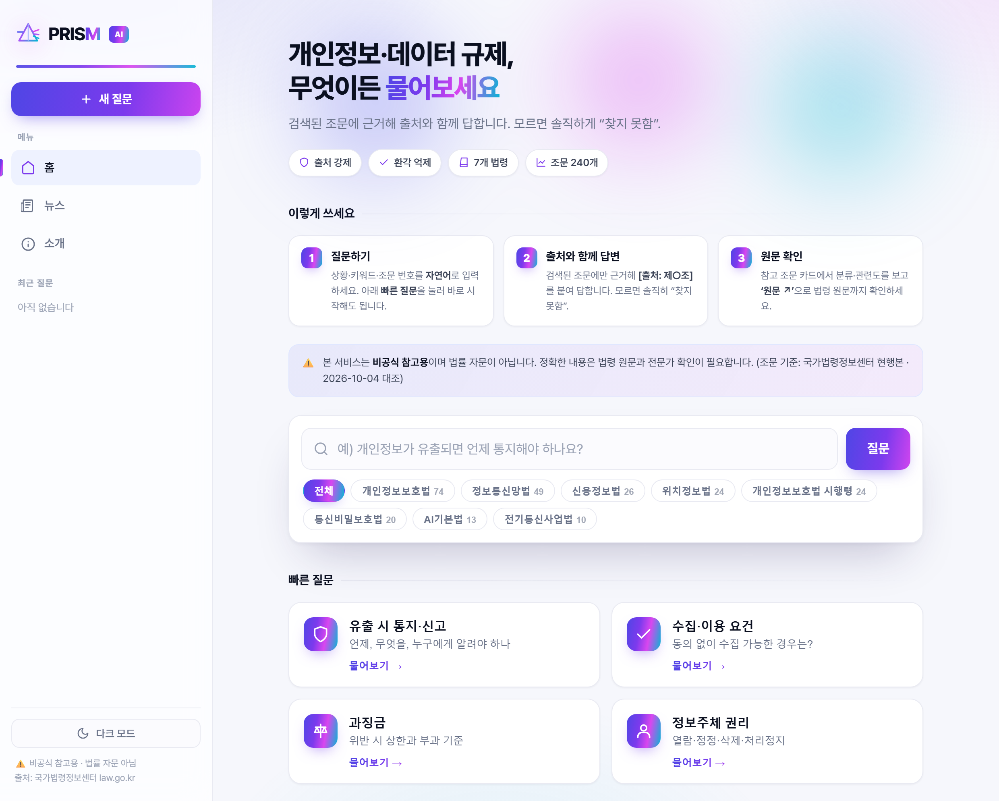
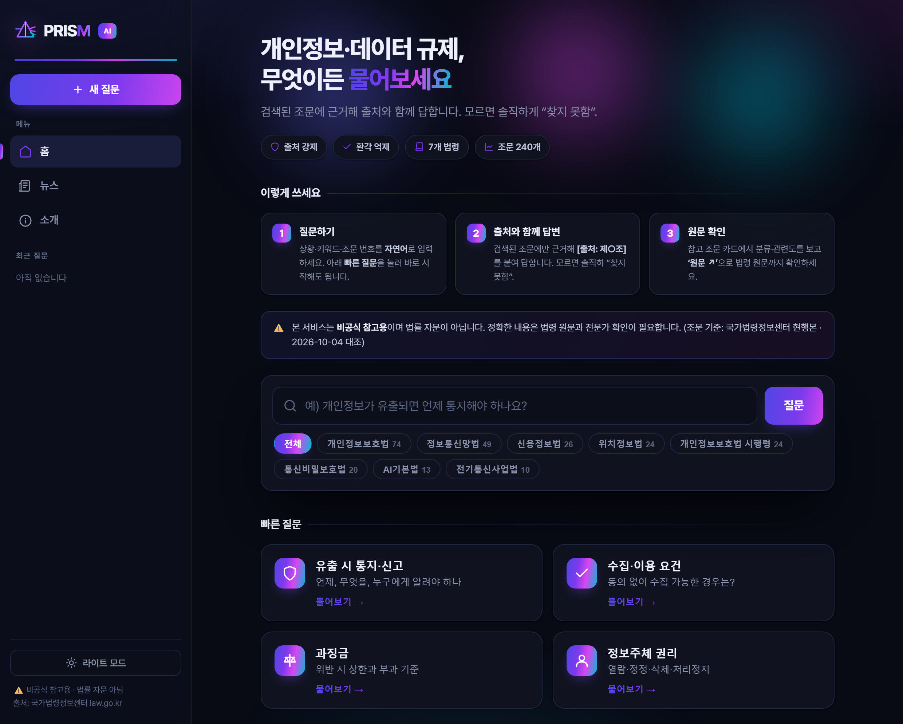
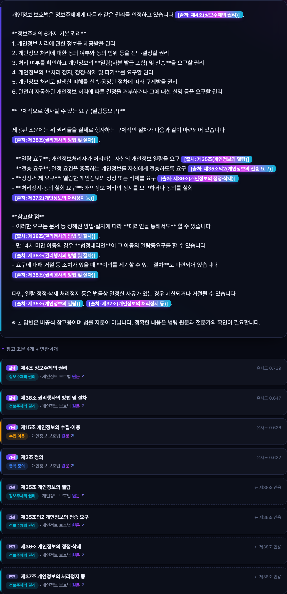
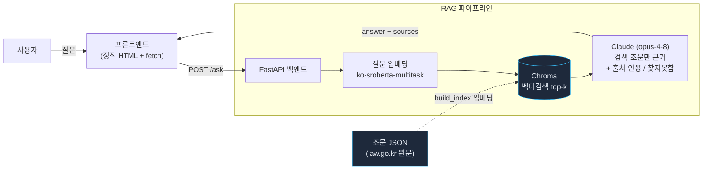

# PRISM — 개인정보보호법 RAG 챗봇

> **P**rivacy **R**egulation **I**ntelligent **S**earch **M**odel
> 개인정보·데이터 규제 법령(개인정보보호법·정보통신망법·신용정보법·위치정보법·AI기본법·통신비밀보호법)을 자연어로 질문하면, 관련 조문을 **검색**해 쉬운 말로 답하고 **출처(법령·조/항/호)를 인용**하는 RAG 챗봇.

[](https://pmo88-prism.hf.space)


**▶ 라이브 데모: [pmo88-prism.hf.space](https://pmo88-prism.hf.space)** · 무료 호스팅이라 첫 응답은 콜드스타트로 ~1분 걸릴 수 있습니다.

> ⚠️ **비공식 참고용입니다. 법률 자문이 아니며, 정확한 내용은 법령 원문과 전문가 확인이 필요합니다.**
> 조문 기준: **국가법령정보센터 현행본** — 법령별 기준 시행본은 [`data/_versions.json`](data/_versions.json)에 기록(예: 개인정보 보호법 법률 제21445호, 2026-09-11 시행). `python -m scripts.sync_laws`로 현행 원문과 조문 단위 대조.

---

## 미리보기

| 홈 — 라이트 | 홈 — 다크 |
|:---:|:---:|
|  |  |

**출처와 함께 답하는 답변 화면** — 글래스 답변 카드 · 조문 카테고리별 컬러 소스 · 인용 칩



---

## 한눈에 보기

자연어 질문 → 한국어 임베딩으로 관련 조문 검색 → Claude가 **검색된 조문에만 근거**해 출처를 인용하며 답변. 모르면 지어내지 않고 "찾지 못함"이라고 답합니다.

| 질문 | 동작 |
|---|---|
| "개인정보가 유출되면 언제 통지해야 하나?" | 법 제34조("지체 없이" + 통지 항목)와 그 위임을 받은 **시행령 제39조(72시간 이내)** 를 함께 근거로 제시 — 법↔시행령 연결 `[출처: 개인정보보호법 제34조(...)]` |
| "동의 없이 수집 가능한 경우는?" | 제15조·제16조·제28조의2 근거 답변 |
| "과징금은 얼마까지?" | 제64조의2 — 전체 매출액의 **100분의 3** 이하, 3년 내 반복·1천만명 이상 피해 등은 **100분의 10** 이하(2026-09-11 시행 개정 반영) |
| "드론 촬영 규제 알려줘" (없는 주제) | "제공된 조문에서는 찾지 못했습니다" + 제25조는 고정형이라 드론과 다름을 구분 |

답변 생성 모델(LLM)을 쓸 수 없을 때는 오류 화면 대신 **검색 전용 응답**으로 물러나, 검색된 조문 원문을 출처와 함께 그대로 보여줍니다.

**왜 이 주제인가** — 2026년 개정 시행(과징금 상향·CPO 책임 강화·유출 가능성 통지 등)과 "AI 융합사회" 규제로 개인정보×AI는 가장 시의성 높은 영역. 보안·법규 도메인 이해와 RAG/FastAPI 엔지니어링을 동시에 증명.

---

## 아키텍처


```mermaid
flowchart LR
    U["사용자"] -->|질문| F["프론트엔드<br/>(정적 HTML + fetch)"]
    F -->|"POST /ask"| API["FastAPI 백엔드"]
    subgraph RAG 파이프라인
        API --> E["질문 임베딩<br/>ko-sroberta-multitask"]
        E --> V[("Chroma<br/>벡터검색 top-k")]
        V --> G["Claude (opus-4-8)<br/>검색 조문만 근거<br/>+ 출처 인용 / 찾지못함"]
    end
    G -->|"answer + sources"| F
    D["조문 JSON<br/>(law.go.kr 원문)"] -.->|build_index 임베딩| V

    classDef store fill:#1e293b,stroke:#38bdf8,color:#e2e8f0;
    class V,D store;
```

데이터(조문 JSON) → 임베딩 → 벡터스토어에 1회 적재. 런타임에는 질문만 임베딩해 top-k 조문을 가져와 LLM 컨텍스트로 주입.

**Hybrid 검색 (Vector + 구조화)**: 벡터 top-k에 더해, 검색된 조문이 본문에서 인용하는 **연관 조문**을 상호참조 그래프로 함께 묶어 제공한다. 예) "목적 외 이용"으로 제18조가 잡히면 제18조가 인용하는 제15·17조도 연관으로 동봉. (외부 법령 인용 「…법」 제N조는 제외)

---

## 기술 스택 & 선택 이유

| 영역 | 선택 | 이유 |
|---|---|---|
| 백엔드 | **FastAPI** + uvicorn | 타입 검증(pydantic)·자동 Swagger·async. RAG API 서버에 적합 |
| LLM | **Anthropic Claude** (opus-4-8) | 한국어 품질·instruction following. adaptive thinking으로 근거 추론 |
| 임베딩 | **sentence-transformers** `jhgan/ko-sroberta-multitask` | 한국어 SBERT, **로컬·무료**(API 비용 0), 768차원 |
| 벡터검색 | **Chroma** (코사인) | 영구 저장·간단한 API, 메타데이터 필터 |
| 프론트 | **정적 HTML + fetch** | 의존성 0, FastAPI가 직접 서빙 → 단일 서비스로 배포 단순 |

---

## 핵심 설계 원칙 (환각 억제)

법률 도메인이라 **정확성·근거**가 생명. 시스템 프롬프트 + **코드 후처리**(`generator._finalize`)로 다음을 강제:

1. **검색된 조문에만 근거** — 제공되지 않은 내용은 추측·생성 금지
2. **출처 인용 강제 + 코드 검증** — `[출처: 제29조(안전조치의무)]` 형식. 인용한 조문이 실제 검색 결과에 없으면(날조 의심) 코드가 경고 배너 부착
3. **모르면 "찾지 못함"** — 다른 지식으로 메우지 않음
4. **고지문 코드 강제** — LLM이 누락해도 코드가 면책 고지를 항상 부착
5. **현행 기준 명시** — 법령별 기준 시행일을 프롬프트·화면에 표시(대조 기록에서 읽음), 미시행 개정분은 단정하지 않음

---

## 빠른 시작

```powershell
# 1) 가상환경 + 의존성
python -m venv venv
.\venv\Scripts\Activate.ps1
pip install -r requirements.txt

# 2) 환경변수 — .env 에 ANTHROPIC_API_KEY 입력
Copy-Item .env.example .env

# 3) 데이터 검증 + 인덱스 빌드
python -m scripts.validate_data
python -m scripts.sync_laws        # (선택) law.go.kr 현행 원문과 조문 단위 대조 — 차이가 있으면 --write로 반영
python -m scripts.build_index      # "유출 통지 → 제34조" 스모크 테스트 포함

# 4) 테스트 (LLM 비호출 — 안전 불변식·API 검증 회귀 방지)
pytest

# 5) 서버 실행
uvicorn app.main:app --reload
#   → http://127.0.0.1:8000  (UI)
#   → http://127.0.0.1:8000/docs  (Swagger)
```

> Windows 콘솔이 cp949면 한글 출력이 깨질 수 있어 스크립트는 UTF-8로 강제(`sys.stdout.reconfigure`). 일회성 실행 시 `$env:PYTHONUTF8=1`.

---

## 검색 정확도 (평가)

LLM을 빼고 **검색 단계만** 측정한다(질문 임베딩 → 벡터 top-k). 정답은 "가장 관련 깊은 (법령, 조문)"으로 큐레이션한 **51개 질의(6개 법령 + 시행령 전부 포함) 기준**:

| 지표 | 값 |
|---|---|
| recall@1 | **0.804** (41/51) |
| recall@4 | **0.941** (48/51) |
| MRR | **0.853** |

```bash
python -m scripts.eval_retrieval   # eval/eval_set.json 기준
```

> 점수를 100%로 맞추지 않았다 — 미스는 실제 한계다. 예) "동의 없이 수집"은 제15조 대신 인접 조문을, "불법 유출 벌칙"은 제71조(벌칙) 대신 제59조(금지행위·유출 금지)를 상위로 반환. **정직한 측정**이 목적.

> 📐 설계 선택의 근거·트레이드오프(ADR): **[DESIGN.md](DESIGN.md)**

---

## 기술적 난제와 해결

### 1. 환각 억제 = 출처 강제
LLM이 그럴듯한 법조문을 지어내는 것이 가장 큰 위험. **검색된 조문만 컨텍스트로 주입 + 출처 인용·찾지못함을 시스템 프롬프트로 강제**해 해결. 실증: 색인에 없는 "드론 규제"는 "찾지 못함"으로 답함. 시행령을 색인하기 전에는 "유출 통지 기한"의 구체 일수(시행령 소관)를 지어내지 않고 "확인할 수 없다"고 답했고, 지금은 연결된 시행령 제39조를 근거로 72시간을 제시함.

### 2. 한국어 임베딩 선택
영어 모델은 한국어 법률 용어 검색 품질이 낮음. `ko-sroberta-multitask`(한국어 SBERT)를 **로컬 추론**으로 채택 → API 비용 0, 데이터 외부 미전송. L2 정규화 후 코사인 유사도로 검색. **품질 측정(51문항·6법령+시행령·(법령,조문) 정답 기준): recall@1 0.80 · recall@4 0.94 · MRR 0.85** — `python -m scripts.eval_retrieval`로 재현·회귀 감지(시행령 질의 rank-1 4/4; 모법↔시행령 주제 중첩 시 양방향 링크가 둘 다 표면화).

### 3. 법령 데이터 정확성 (날조 0) — 현행 원문과 기계 대조
법조문은 한 글자도 틀리면 안 되고, **법령은 계속 개정된다**. 처음에는 병렬 에이전트 수집 + 미러 사이트 교차검증 + 스폿체크로 **6개 법령 + 개인정보보호법 시행령, 총 117개 조문**을 모았다. 수집 100일 뒤 law.go.kr 현행본과 전 조문을 기계적으로 대조해 보니 **117개 중 38개가 현행과 달랐다**:

- **22개는 이후 개정** — 법령·시행령 7개 중 6개가 새 시행본으로 바뀌었다(개인정보 보호법 2026-09-11 시행: 과징금 10% 구간·유출 가능성 통지·CPO 이사회 의결 / 정보통신망법 2026-10-02 시행: 침해사고 24시간 신고·허위조작정보 등).
- **12개는 수집 당시부터 원문과 달랐다** — 항 누락(개인정보 보호법 제23조 ②③), 각 호 누락(통신비밀보호법 제13조 ②), 이미 바뀐 기관명(방송통신위원회 → 방송미디어통신위원회) 등. 미러가 개정을 늦게 반영했고, 표본 검증은 이를 놓쳤다.
- 4개는 삭제 표기 서식 차이.

그래서 검증 방식을 바꿨다. [`scripts/sync_laws.py`](scripts/sync_laws.py)가 법령별 **현행 시행본을 law.go.kr에서 직접** 받아 조 단위로 파싱하고, 보유 조문의 본문·제목과 대조한다(`--write`로 반영). 본문은 손으로 옮기지 않으며, 조문 추가도 id·분류만 적은 빈 항목을 원문으로 채우는 방식이다. 기준 시행본(시행일·공포번호)은 `data/_versions.json`에 기록돼 프롬프트·화면에 표시되고, 원문 링크는 특정 연혁 버전이 아닌 **항상 현행본**을 가리킨다. 같은 대조를 CI가 매주 돌려 개정을 감지한다.

### 4. Windows Smart App Control × scipy DLL 차단
이 PC는 Smart App Control(Enforce)이 켜져 있어 pip로 받은 **scipy 1.15+의 `_cyutility` 컴파일 DLL을 차단** → sklearn→sentence-transformers 연쇄 import 실패. 영향 범위를 모듈별로 진단(torch·chromadb는 통과)하고, `_cyutility`가 없는 **scipy<1.15(1.14.x)로 고정**해 numpy 2.x 호환을 유지하며 해결.

### 5. 적대적 전수조사 → 코드 강제 안전망 + 테스트
멀티에이전트 적대적 감사로 "출처 강제가 프롬프트 지시일 뿐 코드 보장이 없다"는 갭을 스스로 발견 → 면책 고지·출처 인용을 **결정론적 후처리(`_finalize`)로 코드 강제**(LLM이 누락·날조해도 경고 배너 부착)하고, 순수 함수로 분리해 **pytest 단위 테스트**로 회귀 방지. 외부 뉴스 fetch의 SSRF(사설·메타데이터 IP 차단)·응답 크기 상한·캐시 스탬피드(단일비행 락)도 함께 하드닝.

### 6. LLM 장애 = 서비스 중단이 되지 않게
답변 생성 API가 실패하면(이용 한도 소진·인증·과부하 등) 예전에는 질문마다 오류만 돌려줬다. 검색은 이미 끝난 상태이므로, 이제는 **검색 전용 응답**으로 물러나 상위 조문의 원문을 출처와 함께 그대로 보여준다(원문 그대로라 지어낼 여지가 없다). 운영자 조치가 필요한 장애와 일시적 장애를 구분해 안내하고, `/health`는 마지막 LLM 호출 결과를 함께 보고한다(헬스체크가 유료 호출을 하지 않도록 실제 질문 처리에서 관측).

---

## 본인 기여

데이터 파이프라인(law.go.kr 원문 수집·구조화·검증) → 임베딩/벡터검색 → RAG 백엔드(FastAPI, 출처 강제 프롬프트, 예외처리) → 프론트엔드까지 **전 구간 직접 설계·구현**. 각 기술 선택의 근거와 트레이드오프를 문서화.

---

## 한계 및 향후 계획

- **법령·조문 범위**: **6개 법령 + 개인정보보호법 시행령, 총 117개 조문** — 개인정보보호법(수집·이용·동의·정보주체 권리·가명정보·적용범위·CPO·감독제재·손해배상·과징금 등 53), 정보통신망법(불법정보·침해금지·스팸·본인확인·정보보호책임자·침해사고 등 19), 신용정보법(개인신용정보·자동화평가·마이데이터·손해배상 등 13), 위치정보법(수집·이용·정보주체 권리·긴급구조·8세 이하 아동 보호 등 12), AI기본법(고영향 AI·생성형 AI 투명성·영향평가·윤리원칙 등 7), 통신비밀보호법(통신·대화 비밀·감청·통신사실확인자료·통신제한조치 등 6), 개인정보보호법 시행령(안전조치·영향평가·유출 통지/신고 등 7). 조문 추가는 `sync_laws`가 현행 원문에서 채운다. **법령 필터·크로스-법령 상호참조·법↔시행령 연결 ✅ 구현**(예: 신용정보법 제40조 → 정보통신망법 제50조 준용, 법 제29조 안전조치 → 시행령 제30조 세부기준). *구어체 쿼리 리랭킹·타 법 시행령은 향후 과제.*
- **시행령 핵심 연결 ✅**: 개인정보보호법 시행령 7조문(안전조치·영향평가·유출 통지/신고 등)을 법↔시행령 양방향 그래프로 연결 — 법 조문을 물으면 위임된 시행령 세부기준(72시간·암호화·5만명 기준 등)이 함께 표면화. 타 법 시행령·개인정보위 해설서는 향후 확장.
- **Hybrid RAG ✅ 구현**: 조문 간 상호참조를 그래프로 구조화(Vector+구조화)해 연관 조문을 함께 반환 — **법령 내부 + 크로스-법령(준용·근거) + 법↔시행령** 모두.
- **현행성**: 대조는 "지금 시행 중인 본문" 기준이다. 공포됐지만 아직 시행 전인 개정(예: 개인정보 보호법 2027-03-09 시행분)은 시행일이 지나야 대조에서 차이로 잡히며, 그 전까지는 답변에 반영하지 않는다. 보유하지 않은 조문·하위 고시는 범위 밖.
- **배포**: 정적 프론트를 FastAPI가 서빙해 단일 서비스. 무료 티어 배포 시 임베딩 모델 메모리(torch) 고려 필요(데모 영상 대안).

---

## 프로젝트 구조

```
PRISM/
├── app/
│   ├── main.py            # FastAPI: GET / (UI)·POST /ask·GET /laws·/news·/health, 레이트리밋·CORS
│   ├── config.py          # pydantic-settings (.env)
│   ├── models.py          # Article 도메인 모델
│   ├── loader.py          # 조문 JSON·기준 시행본 로더
│   ├── service.py         # 검색→생성 오케스트레이션(LLM 장애 시 검색 전용 응답)
│   ├── news.py            # 개인정보·보안 뉴스(데일리시큐 RSS + og:image, SSRF 방어)
│   └── rag/
│       ├── embedder.py    # 한국어 SBERT 임베딩
│       ├── vectorstore.py # Chroma
│       ├── relations.py   # 조문 상호참조 그래프 (Hybrid)
│       ├── retriever.py   # 벡터 + Hybrid 검색
│       └── generator.py   # Claude 답변(출처·고지 코드 강제)
├── scripts/
│   ├── validate_data.py   # 로드·누락 리포트
│   ├── sync_laws.py       # law.go.kr 현행 원문과 조문 단위 대조·갱신(표준 라이브러리만)
│   ├── build_index.py     # 임베딩 → Chroma
│   └── eval_retrieval.py  # 검색 정확도 recall@k 평가
├── tests/                 # pytest (안전 불변식·API·데이터 무결성·원문 파서, LLM·네트워크 비호출)
├── eval/eval_set.json     # 검색 평가 질의셋(51 · 6개 법령+시행령 · law-aware)
├── DESIGN.md              # 설계 결정 기록(ADR)
├── data/                  # 법령별 조문 JSON(pipa·network_act·credit_info·ai_act·location_info·pipa_decree·comm_secret) 117개 + _versions.json(기준 시행본)
├── frontend/index.html    # 앱셸 UI (홈·뉴스·소개)
└── requirements.txt
```

---

## 출처 & 면책

- 조문 원문: **국가법령정보센터(law.go.kr)** 현행본 — 법령별 기준 시행본은 `data/_versions.json`(2026-10-04 대조 기준: 개인정보 보호법 법률 제21445호·2026-09-11 시행, 정보통신망법 법률 제21988호·2026-10-02 시행 등).
- 본 프로젝트는 **비공식 참고용**이며 법률 자문이 아닙니다. 정확한 내용은 법령 원문과 전문가 확인이 필요합니다. 공식 기관 도구가 아닙니다.

## 라이선스

MIT — [LICENSE](LICENSE)
